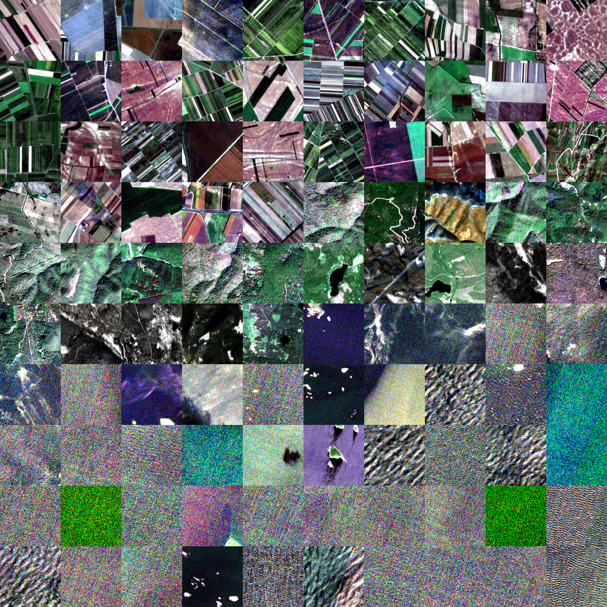
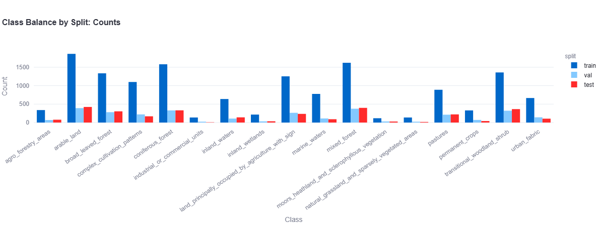
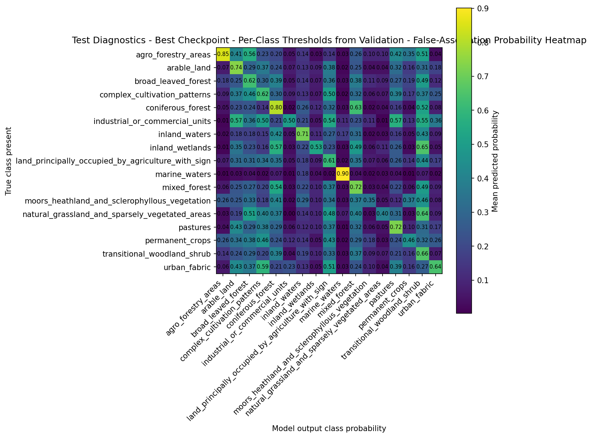
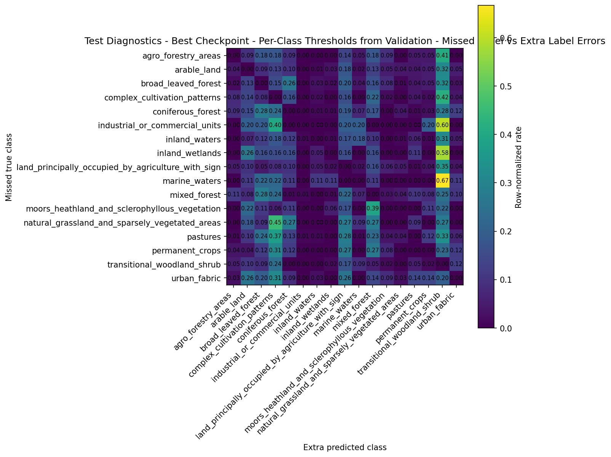

# BigEarthNet Multi-Label Satellite Classification

[← Back to Portfolio](../index.md)

## PyTorch Multi-Label Classification for Remote Sensing Imagery

This project trains a multi-label satellite image classifier on a curated 17-class BigEarthNet v2 dataset exported from CVDMS.

Unlike single-label classification, each image can contain multiple land-cover classes at once. The model must learn overlapping visual concepts such as forests, agriculture, pasture, shrubland, water, and mixed land-use patterns from overhead imagery.

   
  <em>Test-set mosaic ordered by multi-label structure, so similar label combinations appear near each other.</em>

## Project Snapshot

| Area        | Summary                                                |
| ----------- | ------------------------------------------------------ |
| Task        | Multi-label satellite image classification             |
| Dataset     | Curated BigEarthNet v2 subset                          |
| Classes     | 17 land-cover labels                                   |
| Model       | PyTorch ResNet-18                                      |
| Loss        | `BCEWithLogitsLoss`                                    |
| Labels      | Multi-hot vectors                                      |
| Evaluation  | Macro/micro F1, mAP, hamming accuracy, subset accuracy |
| Data source | CVDMS dataset-version artifacts                        |

## Problem

BigEarthNet is challenging because many land-cover categories are visually and semantically similar from overhead imagery.

Examples include:

* forest classes: `broad_leaved_forest`, `coniferous_forest`, `mixed_forest`
* vegetation classes: `transitional_woodland_shrub`
* agriculture classes: `arable_land`, `pastures`, `complex_cultivation_patterns`
* mixed land-use classes with both agriculture and natural vegetation

The goal was to build a clean multi-label training workflow, evaluate thresholded predictions, and inspect which mistakes were random versus structurally meaningful.

## Dataset

The dataset was exported from CVDMS and cached locally for training.

| Split      | Images |
| ---------- | -----: |
| Train      |  5,000 |
| Validation |  1,000 |
| Test       |  1,000 |

CVDMS visualization artifacts were used to inspect class balance, split behavior, and image-quality summaries before training.

   
  <em>Class distribution across train, validation, and test splits. Class imbalance is one of the main dataset challenges.</em>

## Approach

The workflow includes:

* CVDMS dataset manifests as the source of truth
* local image caching to avoid repeated S3 reads during training
* dataset inspection before training
* PyTorch DataLoaders with multi-hot labels
* ResNet-18 transfer learning
* `BCEWithLogitsLoss` for multi-label classification
* thresholded predictions for final label decisions
* per-class diagnostics after evaluation

Training used a three-phase transfer-learning schedule:

| Phase | Strategy                           |
| ----- | ---------------------------------- |
| 1     | Train only the classifier head     |
| 2     | Unfreeze deeper backbone layers    |
| 3     | Fine-tune with lower learning rate |

This structure made the project a practical transfer-learning workflow rather than a one-off model fit.

## Results

The best checkpoint was evaluated on the test set with a default global threshold of `0.5`. I then selected per-class thresholds using validation predictions only and evaluated those frozen thresholds on the test set.

| Metric           | Global threshold 0.5 | Per-class thresholds |    Change |
| ---------------- | -------------------: | -------------------: | --------: |
| Macro precision  |               0.4824 |               0.5394 |   +0.0570 |
| Macro recall     |               0.6727 |               0.6033 |   -0.0694 |
| Macro F1         |               0.5521 |               0.5603 |   +0.0083 |
| Micro F1         |               0.6530 |               0.6602 |   +0.0072 |
| Hamming accuracy |               0.8612 |               0.8714 |   +0.0102 |
| Subset accuracy  |               0.1490 |               0.1640 |   +0.0150 |
| mAP              |               0.5761 |               0.5761 | unchanged |

Per-class thresholding modestly improved thresholded metrics, especially precision and hamming accuracy. The recall tradeoff shows that the tuned thresholds mainly reduced class-specific over-prediction rather than fully solving the underlying class ambiguity.

## Diagnostic Analysis

The most useful diagnostic result was the structure of the model’s errors. Because BigEarthNet is multi-label, these heatmaps are not standard confusion matrices; they show label associations, co-occurrence patterns, and structured failure modes, with many errors clustering around visually related land-cover groups such as forest/woodland/shrub and agriculture/pasture/cultivation classes.

The first heatmap shows how often each predicted label is associated with each true label across the test set. The strong diagonal pattern is a useful sanity check: the model most often associates each class with itself, while off-diagonal structure highlights related or frequently co-occurring land-cover labels.

   
  <em>False-association probability heatmap for predicted labels versus true labels on the test set.</em>

The second heatmap focuses only on imperfect predictions. Rows represent true labels that were missed, while columns represent extra labels that were predicted, making it useful for diagnosing which land-cover classes are confused when the model makes multi-label errors.

   
  <em>Missed-vs-extra label heatmap showing structured multi-label error patterns on the test set.</em>

Common patterns:

| Pattern                                                      | Interpretation                                                                                  |
| ------------------------------------------------------------ | ----------------------------------------------------------------------------------------------- |
| Forest classes → `transitional_woodland_shrub`               | The model often uses a broad shrub/woodland label when uncertain among vegetation-heavy scenes. |
| `broad_leaved_forest` / `mixed_forest` / `coniferous_forest` | Forest-type boundaries are visually subtle from overhead imagery.                               |
| `pastures` / `complex_cultivation_patterns` / `arable_land`  | Agricultural classes share field textures and mosaic patterns.                                  |
| `marine_waters`                                              | This class is comparatively clean, showing the model learns visually distinctive labels well.   |

This is a useful modeling result: the classifier learned meaningful visual structure, but the dataset contains genuinely overlapping labels that require careful thresholding and per-class analysis.

## Engineering Highlights

| Category        | Highlights                                                  |
| --------------- | ----------------------------------------------------------- |
| Computer vision | Multi-label satellite image classification                  |
| Deep learning   | PyTorch, ResNet-18, transfer learning                       |
| Data handling   | CVDMS manifests, local image cache, DataLoaders             |
| Labeling        | Multi-hot vectors, 17 land-cover classes                    |
| Loss / metrics  | `BCEWithLogitsLoss`, macro/micro F1, mAP, hamming accuracy  |
| Evaluation      | Global threshold vs. validation-tuned per-class thresholds  |
| Diagnostics     | Confusion heatmaps, class imbalance charts, dataset mosaics |

## Limitations

The final thresholded performance is modest because many land-cover classes are visually similar and semantically overlapping. Per-class thresholding helped, but did not fully resolve ambiguity between related vegetation and agriculture labels.

Future improvements could include stronger satellite-specific backbones, larger training subsets, class-balanced sampling, additional thresholding strategies, and per-class augmentation or calibration experiments.

## Links

* [Source code and full documentation](https://github.com/bodle720/MLProjects/tree/main/Training_Projects/projects/MultiLabel_BigEarthNetv2)
* [CVDMS infrastructure](https://github.com/bodle720/MLProjects/tree/main/AWS_Tools/Computer_Vision_DMS/cvdms_cdk)
