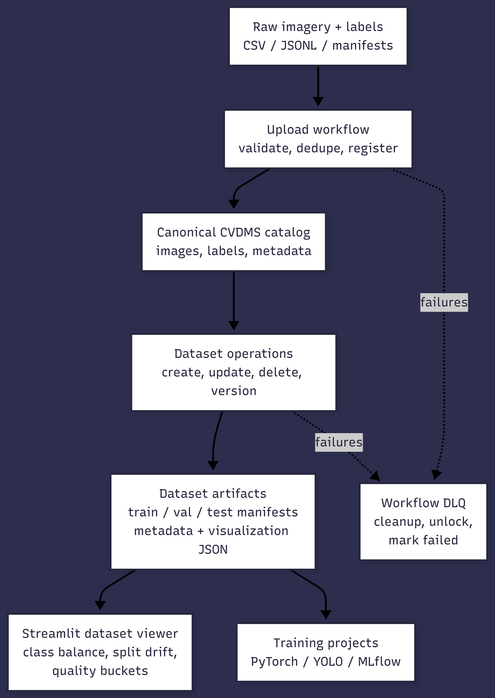
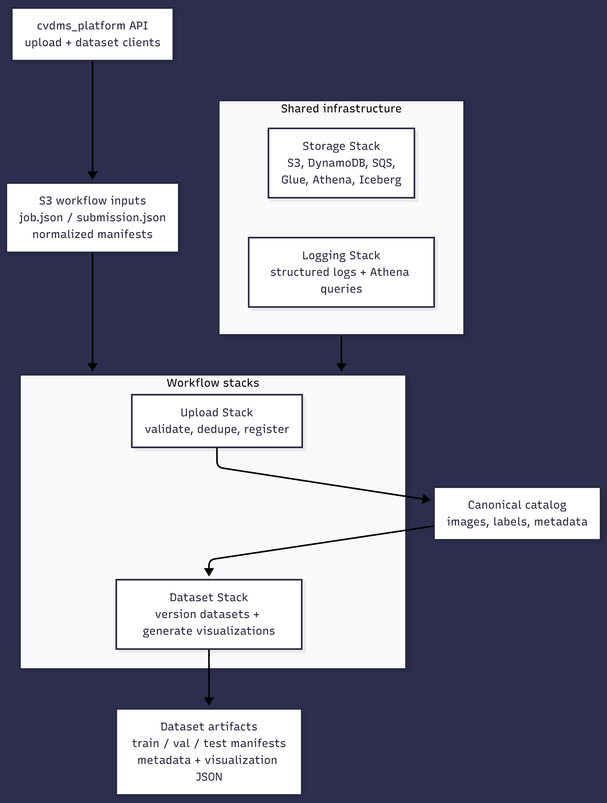
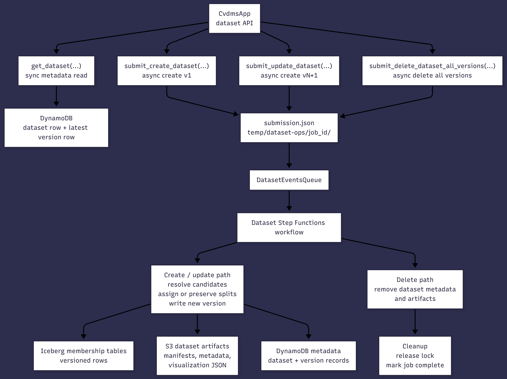
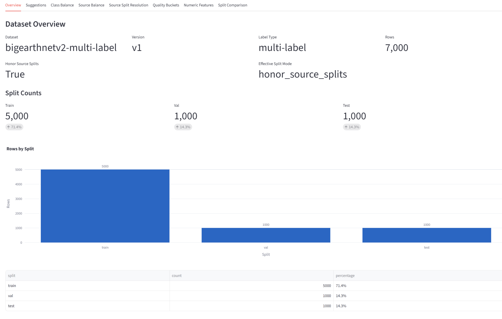

# Computer Vision Dataset Management System

[← Back to Portfolio](../README.md)

## AWS-Based Data Infrastructure for Computer Vision Workflows

CVDMS is an AWS CDK-based system for managing computer vision imagery, labels, metadata, and reproducible dataset versions.

The project is designed as a durable data layer beneath model-training workflows. Raw images and labels are uploaded once, validated, normalized, deduplicated, registered into a canonical catalog, and reused to create versioned train/validation/test datasets for downstream machine learning projects.

   
  <em>CVDMS workflow from raw imagery and labels to versioned dataset artifacts and downstream training projects.</em>

## Why This Project Matters

Computer vision projects often struggle with messy labels, duplicated imagery, inconsistent formats, unclear train/test provenance, and one-off dataset exports. CVDMS addresses those problems by creating a canonical, queryable, versioned data-management layer for CV datasets.

The system supports:

* single-label classification
* multi-label classification
* object detection
* semantic segmentation
* instance segmentation

This makes it useful across common computer vision workflows, from classification notebooks to YOLO object-detection pipelines.

## Architecture

CVDMS is organized into separate AWS CDK stacks for logging, storage, upload processing, and dataset operations.

   
  <em>AWS CDK architecture with logging, storage, upload, and dataset operation stacks.</em>

Core technologies:

| Area           | Technologies                              |
| -------------- | ----------------------------------------- |
| Infrastructure | AWS CDK, Python                           |
| Orchestration  | Step Functions, SQS                       |
| Compute        | Lambda, AWS Batch                         |
| Storage        | S3, DynamoDB                              |
| Analytics      | Glue, Athena, Apache Iceberg, Parquet     |
| Logging        | Kinesis Firehose, transform Lambda, S3    |
| Visualization  | Streamlit, Plotly                         |
| ML integration | PyTorch / YOLO / MLflow training projects |

## Upload Workflow

The upload workflow converts raw imagery and labels into canonical CVDMS records.

It accepts common manifest formats such as CSV, JSONL, NDJSON, and Ground Truth-style manifests, validates the input, normalizes task-specific annotations into an internal `cvdms.manifest.v1` schema, uploads workflow files to S3, and triggers an AWS ingestion workflow.

The server-side workflow performs:

* image and label validation
* SHA256-based duplicate detection
* image-quality feature computation
* canonical image registration
* canonical label registration
* label enrichment for already-seen imagery
* cleanup and failure handling through DLQ processing

This lets downstream projects work from standardized, registered image and label assets rather than raw one-off annotation files.

## Dataset Operations

After images and labels are registered, CVDMS can create reproducible dataset versions from the canonical catalog.

Datasets are not edited in place. Each create or update operation produces a new immutable version with its own membership rows, metadata, manifests, and visualization artifacts.

   
  <em>Dataset API requests create immutable dataset versions with Iceberg membership rows, S3 artifacts, and DynamoDB provenance.</em>

Each dataset version can produce:

* `train.jsonl`
* `val.jsonl`
* `test.jsonl`
* `all.jsonl`
* metadata JSON
* selection config JSON
* selection SQL
* enriched membership CSV
* visualization artifacts

The system supports both derived train/validation/test splits and source-split preservation. Source-split preservation is important when the upstream dataset already provides official splits, as in the Global Wheat Head Detection project.

## Dataset Filtering and Split Control

Dataset creation uses a selection config to choose images and labels from the canonical catalog.

Supported filters include:

* allowed classes
* allowed data sources
* upload date ranges
* image width and height ranges
* lighting buckets
* blur buckets
* contrast buckets
* color buckets

The split strategy is deterministic and leakage-aware. When possible, duplicate-content groups are kept in the same split using image hashes, which helps avoid accidental train/test leakage.

## Dataset Viewer

CVDMS includes a local Streamlit dashboard for inspecting dataset visualization artifacts generated by the Dataset Stack.

The viewer reads JSON artifacts from S3 and renders charts, tables, and diagnostics for a selected dataset version.

   
  <em>Dataset viewer for inspecting split balance, class distribution, source drift, and image-quality buckets.</em>

The dashboard helps inspect:

* dataset overview and split counts
* class balance
* source balance
* source split resolution
* lighting, blur, contrast, and color buckets
* numeric image features
* train/validation/test drift diagnostics
* raw visualization artifacts for debugging

This gives a dataset-review step before model training, similar in spirit to TensorBoard, but focused on dataset health instead of model metrics.

## Engineering Highlights

| Category           | Highlights                                                            |
| ------------------ | --------------------------------------------------------------------- |
| Cloud architecture | AWS CDK, Step Functions, Lambda, Batch, SQS                           |
| Data layer         | S3, DynamoDB, Glue, Athena, Iceberg, Parquet                          |
| CV data model      | Canonical images, canonical labels, multi-task label support          |
| Dataset versioning | Immutable versions, train/val/test manifests, provenance metadata     |
| Reliability        | DLQs, workflow locks, cleanup paths, deterministic processing         |
| ML workflow        | Dataset artifacts for PyTorch, YOLO, MLflow, and downstream training  |
| Inspection         | Streamlit viewer for class balance, source drift, and quality buckets |

## Connection to Model Training

CVDMS is not just an isolated infrastructure project. It directly supports downstream computer vision training projects.

For example, the Global Wheat Head Detection YOLO project uses CVDMS-exported object-detection artifacts as the source of truth for training, validation, test evaluation, dataset profiling, and split analysis.

This shows the intended role of CVDMS: a reusable data-management foundation for computer vision model development.

## Future Work

Potential improvements include:

* perceptual hashing or image-similarity duplicate detection
* stronger duplicate handling across compression and resizing changes
* expanded dataset drift summaries
* side-by-side comparison of dataset versions in the viewer

## Links

* [Source code and full documentation](https://github.com/bodle720/MLProjects/tree/main/AWS_Tools/Computer_Vision_DMS/cvdms_cdk)
* [Upload workflow README](https://github.com/bodle720/MLProjects/tree/main/AWS_Tools/Computer_Vision_DMS/cvdms_cdk/README_upload.md)
* [Dataset operations README](https://github.com/bodle720/MLProjects/tree/main/AWS_Tools/Computer_Vision_DMS/cvdms_cdk/README_datasets.md)
* [Infrastructure stacks README](https://github.com/bodle720/MLProjects/tree/main/AWS_Tools/Computer_Vision_DMS/cvdms_cdk/README_stacks.md)
* [Dataset viewer README](https://github.com/bodle720/MLProjects/tree/main/AWS_Tools/Computer_Vision_DMS/cvdms_cdk/visualization_tool/README.md)
* [Upload walkthrough notebook](https://github.com/bodle720/MLProjects/tree/main/AWS_Tools/Computer_Vision_DMS/cvdms_cdk/sample_walkthrough_upload.ipynb)
* [Dataset walkthrough notebook](https://github.com/bodle720/MLProjects/tree/main/AWS_Tools/Computer_Vision_DMS/cvdms_cdk/sample_walkthrough_datasets.ipynb)
