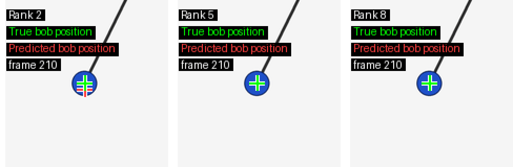

# Dynamic Mode Decomposition for Pendulum Video Analysis

[← Back to Portfolio](../README.md)

## Applied Math, Video Dynamics, and Low-Rank Forecasting

This project applies Dynamic Mode Decomposition to a synthetic pendulum video sequence. The goal is to connect high-dimensional video data with low-rank temporal structure, eigenvalues, spatial modes, frequency interpretation, reconstruction behavior, and forecasting.

The synthetic pendulum is a controlled visual dynamical system: each video frame is a high-dimensional pixel observation, but the underlying motion is a low-dimensional periodic swing.

<p align="center">
  <br>
  <em>Synthetic pendulum video used as a controlled dynamical system for DMD analysis.</em>
</p>

## Project Snapshot

| Area            | Summary                                                             |
| --------------- | ------------------------------------------------------------------- |
| Task            | Video-based dynamical system analysis                               |
| Method          | Dynamic Mode Decomposition                                          |
| Data            | Synthetic pendulum video                                            |
| Core tools      | Python, NumPy, SVD, eigenvalue analysis, visualization              |
| Main comparison | Full-frame pixel DMD vs. delay-coordinate bob-trajectory DMD        |
| Main lesson     | DMD performance depends strongly on the chosen state representation |

## Problem

A video frame is a high-dimensional observation, but the pendulum motion itself is governed by a much simpler low-dimensional periodic process.

The project asks:

> Can DMD recover useful spatial modes, frequencies, reconstruction behavior, and forecasts from video data?

DMD learns an approximate linear time-advance model:

```text
x[k+1] ≈ A x[k]
```

For video, each `x[k]` is a flattened image frame or a lower-dimensional state representation derived from the motion.

## Approach

The notebook walks through two related DMD experiments.

### 1. Full-Frame Pixel DMD

The first model applies DMD directly to centered grayscale video frames.

This shows how DMD can extract:

* spatial modes from video frames
* oscillatory eigenvalue pairs
* frequency estimates from eigenvalue phases
* damping behavior from eigenvalue magnitudes
* reconstruction behavior over time

The full-frame model recovers meaningful spatial structure and near-correct oscillation frequencies, but important motion modes are strongly damped. As a result, reconstruction tends to decay toward the mean frame.

### 2. Delay-Coordinate DMD on Bob Trajectory

The second model uses the known pendulum bob coordinates as a lower-dimensional state representation.

This representation is much closer to the true underlying dynamics. A delay-coordinate DMD model recovers the oscillation more accurately and produces better trajectory forecasts.

<p align="center">
  <br>
  <em>Coordinate-level DMD forecast comparison across ranks.</em>
</p>

## Key Result

The most important result is the contrast between the two representations.

| Representation           | Outcome                                                                                        |
| ------------------------ | ---------------------------------------------------------------------------------------------- |
| Full-frame pixel DMD     | Finds meaningful modes and frequencies, but motion modes are damped and reconstruction decays  |
| Bob-coordinate delay DMD | Better matches the true low-dimensional pendulum dynamics and forecasts motion more accurately |

This is the main lesson of the project:

> DMD is not only about fitting a model. The chosen state representation strongly affects whether the learned dynamics are useful.

## What the Notebook Demonstrates

The notebook includes:

* synthetic pendulum video generation
* snapshot matrix construction
* singular-value inspection and rank selection
* full-frame DMD fitting
* eigenvalue, damping, and frequency interpretation
* DMD mode visualization
* reconstruction diagnostics
* delay-coordinate DMD on bob coordinates
* coordinate reconstruction and forecasting
* rank-sensitivity comparison
* discussion of limitations and extensions

## Engineering and Math Highlights

| Category          | Highlights                                                        |
| ----------------- | ----------------------------------------------------------------- |
| Applied math      | SVD, eigenvalues, modes, low-rank linear dynamics                 |
| Video analysis    | Treats frames as high-dimensional time-series observations        |
| Signal processing | Frequency interpretation, Nyquist awareness, oscillatory modes    |
| Diagnostics       | Reconstruction decay, mode damping, rank sensitivity              |
| Modeling judgment | Shows why state representation matters                            |
| Communication     | Includes background notes explaining the math behind the notebook |

## Background Notes

I also wrote supporting notes for the mathematical ideas behind the notebook, including:

* modes and eigenvalues
* continuous vs. discrete dynamics
* matrix exponentials
* DMD and video snapshots
* DMD frequency interpretation
* Nyquist frequency
* complex DMD modes and conjugate pairs

These notes make the project more than a visual demo; they show the theory behind the implementation and how to interpret the results.

## Limitations

This is a controlled synthetic example, not a production video forecasting system. That is intentional: the clean pendulum setup makes the DMD behavior easier to interpret and diagnose.

Possible extensions include applying DMD to noisier real-world motion, testing foreground/background separation, comparing additional delay embeddings, and evaluating other reduced-state representations.

## Links

* [Source code and notebook](https://github.com/bodle720/DSTopics/tree/main/DMD)
* [Open the notebook](https://github.com/bodle720/DSTopics/blob/main/DMD/DMD_pendulum_video.ipynb)
* [DMD background notes](https://github.com/bodle720/DSTopics/tree/main/DMD/docs/DMD_Background)
