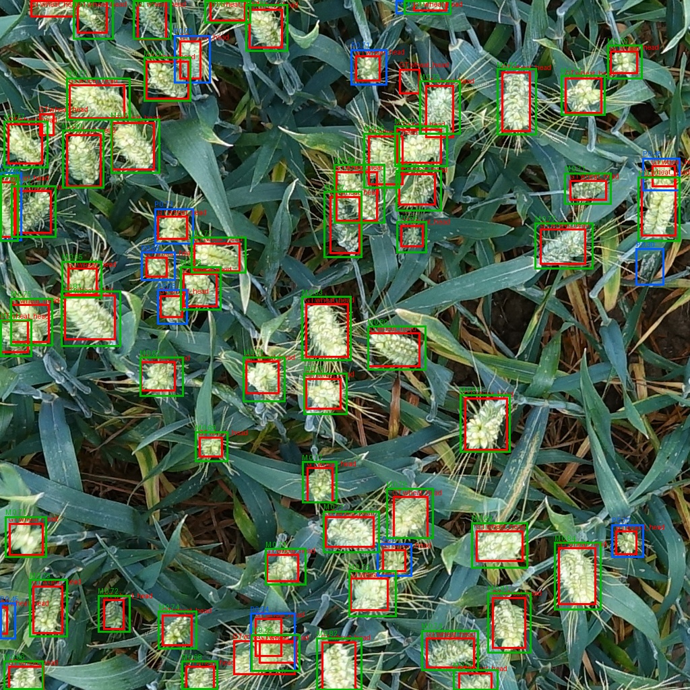
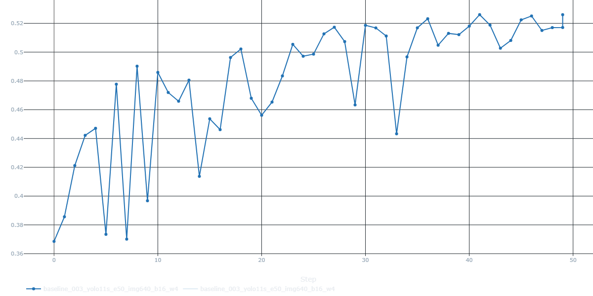
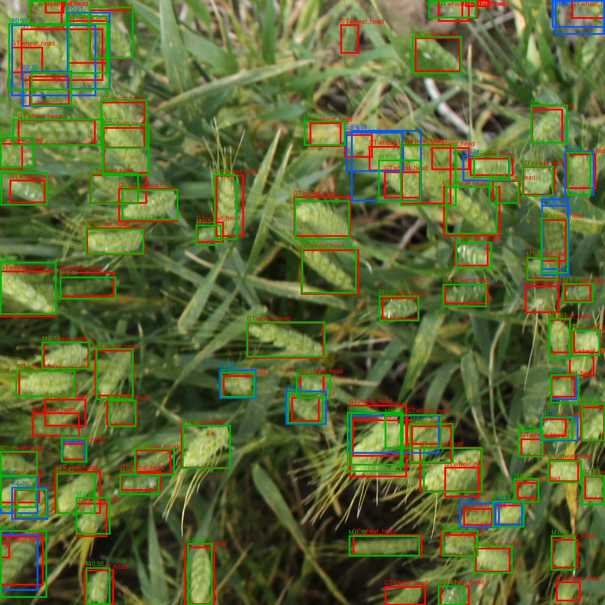
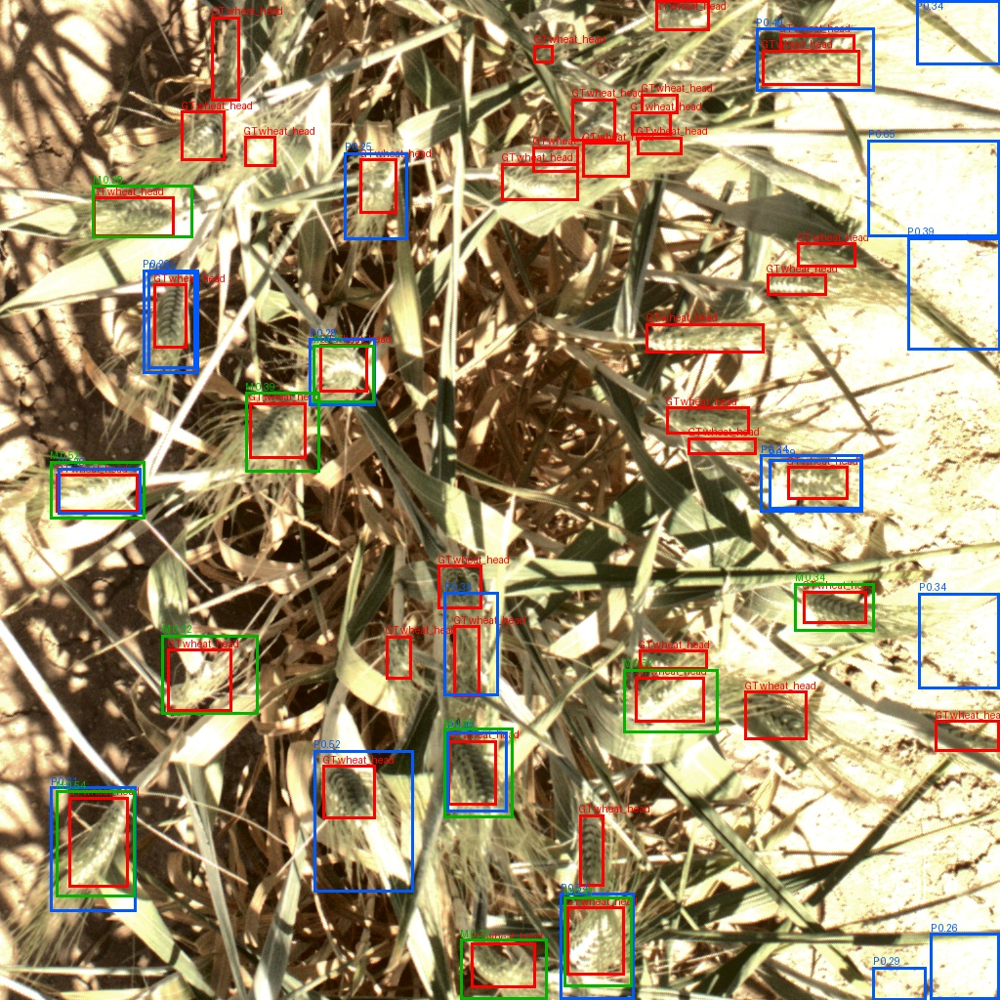

# Global Wheat Head Detection

[← Back to Portfolio](../README.md)

## End-to-End YOLO Object Detection for Dense Agricultural Imagery

This project builds a deployment-ready computer vision workflow for detecting individual wheat heads in field imagery using the Global Wheat Head Detection 2021 dataset.

The task is a dense small-object detection problem: each image can contain dozens of visually similar wheat heads that are tightly packed, partially occluded, or difficult to separate from the surrounding crop structure. The project goes beyond model training by covering dataset ingestion, data analysis, YOLO conversion, experiment tracking, validation-based model selection, held-out test evaluation, and Dockerized FastAPI inference.

<p align="center">
  <br>
  <em>Example held-out test image with ground truth boxes, matched predictions, and unmatched predictions.</em>
</p>

## Why This Project Matters

Many computer vision projects stop at a notebook or a single training run. This project is designed as a more complete ML engineering workflow:

```text
CVDMS dataset artifacts
        ↓
local dataset cache and visual inspection
        ↓
YOLO-format conversion
        ↓
YOLO training experiments
        ↓
MLflow and TensorBoard tracking
        ↓
validation-based model selection
        ↓
held-out test evaluation
        ↓
MLflow champion registration
        ↓
FastAPI/Docker inference service
```

The goal was not only to train a detector, but to build the surrounding workflow needed to make model results reproducible, inspectable, and deployable.

## Problem

Wheat-head detection is relevant to crop monitoring, phenotyping, agriculture analytics, and food-security applications. The model must localize many small objects in high-resolution field images while handling changes in lighting, color, contrast, object density, and crop appearance.

This project uses a single object class:

```text
wheat_head
```

The dataset contains official train, validation, and test splits. These splits were preserved rather than randomly recreated, which makes the evaluation more realistic because the model must generalize across the source dataset’s original distribution differences.

## Dataset

The dataset was ingested through my Computer Vision Dataset Management System, then exported as a versioned object-detection dataset for training.

| Split      | Images | Avg. boxes / image |
| ---------- | -----: | -----------------: |
| Train      |  3,605 |               45.4 |
| Validation |  1,448 |               30.6 |
| Test       |  1,334 |               50.5 |
| Total      |  6,387 |                  — |

The test split is especially demanding because it has the highest average object density. Earlier dataset profiling also showed measurable split drift in color richness, lighting, and contrast.

<p align="center">
  <br>
  <em>CVDMS dataset profiling revealed lighting differences across train, validation, and test splits.</em>
</p>

These findings informed the training strategy. Because the dataset is visually inconsistent across splits, the training workflow used targeted augmentation and careful validation/test comparison rather than relying on a single aggregate score.

## Method

The project includes four major pieces:

### 1. Dataset Preparation

The source dataset was first organized through CVDMS, then cached locally and converted into Ultralytics YOLO format.

Key steps included:

* preserving official source splits
* validating image and label artifacts
* profiling image quality features
* inspecting split drift
* generating ground-truth mosaics
* converting object-detection labels into YOLO format

### 2. YOLO Training Experiments

I trained and compared Ultralytics YOLO models using local GPU hardware.

Local training environment:

```text
NVIDIA GeForce RTX 4060 Laptop GPU
8 GB VRAM
```

The training workflow logged model checkpoints, configuration snapshots, metrics, plots, and evaluation outputs to MLflow and TensorBoard.

Selected training experiments included:

| Experiment              | Purpose                    | Result                                         |
| ----------------------- | -------------------------- | ---------------------------------------------- |
| YOLO11n baseline        | Lightweight starting point | Fast, but weaker held-out test performance     |
| YOLO11s baseline        | Larger detector            | Improved recall and test mAP50-95              |
| YOLO11s, 50 epochs      | Longer training            | Best validation-selected model                 |
| YOLO11s, 768 image size | Higher-resolution test     | Higher compute/thermal cost without clear gain |

### 3. Model Selection

The final model was selected using validation mAP50-95 only. The held-out test split was evaluated after the final model was chosen.

The selected model was:

| Field                   | Value                                    |
| ----------------------- | ---------------------------------------- |
| Model                   | YOLO11s                                  |
| Training run            | `baseline_003_yolo11s_e50_img640_b16_w4` |
| Epochs                  | 50                                       |
| Training image size     | 640                                      |
| Batch size              | 16                                       |
| Parameters              | ~9.43M                                   |
| Model size              | ~18.29 MB                                |
| Registered MLflow model | `GlobalWheatHeadDetector`                |
| Registered alias        | `champion`                               |

The winning inference configuration used:

| Setting                          | Value |
| -------------------------------- | ----: |
| Image size                       |   640 |
| NMS IoU                          |   0.8 |
| Max detections                   |  1000 |
| Confidence threshold for metrics | 0.001 |

### 4. Deployment

The selected model was registered in MLflow and served through a Dockerized FastAPI app.

At startup, the API loads:

```text
models:/GlobalWheatHeadDetector@champion
```

The `/predict` endpoint accepts an uploaded image and returns:

* image metadata
* wheat-head detections
* confidence scores
* bounding boxes
* inference settings
* request-level latency measurements

The deployment path separates model tracking from inference serving: MLflow manages the model registry, while FastAPI handles HTTP prediction requests inside Docker.

## Results

The selected YOLO11s model performed strongly on the validation split and showed a meaningful drop on the held-out test split, which is consistent with the dataset’s split drift and higher test-set object density.

| Metric    | Validation | Held-out Test |
| --------- | ---------: | ------------: |
| Precision |      0.924 |         0.806 |
| Recall    |      0.837 |         0.594 |
| mAP50     |      0.920 |         0.684 |
| mAP75     |      0.555 |         0.225 |
| mAP50-95  |      0.528 |         0.309 |

The validation score shows that the model learned the task well under the validation distribution. The lower held-out test score highlights the realistic difficulty of dense wheat-head detection under distribution shift and stricter localization metrics.

<p align="center">
  <br>
  <em>Validation mAP50-95 during training for the selected YOLO11s run.</em>
</p>

## Visual Evaluation

The evaluation package saves full-split metrics and visual examples with ground truth and predictions overlaid.

Box colors:

| Color | Meaning                 |
| ----- | ----------------------- |
| Red   | Ground-truth wheat head |
| Green | Matched prediction      |
| Blue  | Unmatched prediction    |

### Dense Scene Example

<p align="center">
  <br>
  <em>Dense wheat-head scene from the held-out test split.</em>
</p>

### Hard Case Example

<p align="center">
  <br>
  <em>Harder example showing missed or merged wheat heads in a dense scene.</em>
</p>

These examples are important because the project is not only about reporting metrics. Visual inspection shows where the model works well and where dense small-object detection remains difficult.

## Latency

The project reports both offline YOLO evaluation speed and Docker FastAPI request latency.

### Offline YOLO Evaluation Speed

Held-out test evaluation on the local GPU:

| Stage               | Avg. time / image |
| ------------------- | ----------------: |
| Preprocess          |          0.248 ms |
| Inference           |          5.870 ms |
| Postprocess         |          1.001 ms |
| Total eval pipeline |          7.121 ms |

### Docker FastAPI Latency

Local Docker CPU benchmark using 100 sequential `/predict` requests after warmup:

| Measurement                  |      Mean |    Median |        P95 |
| ---------------------------- | --------: | --------: | ---------: |
| Server total request         | 76.379 ms | 74.196 ms | 108.508 ms |
| Server model inference       | 68.656 ms | 66.368 ms |  97.993 ms |
| Client wall-clock round trip | 86.818 ms | 83.665 ms | 119.628 ms |

The Docker benchmark is the most representative measurement for the deployed demo because it exercises the actual API path, including upload handling, image validation, inference, response parsing, and JSON serialization.

## Engineering Highlights

This project demonstrates:

* dense small-object detection with YOLO
* CVDMS dataset ingestion and versioned dataset artifacts
* image-quality and split-drift analysis before training
* CVDMS-to-YOLO conversion
* local GPU training and practical speed tuning
* MLflow and TensorBoard experiment tracking
* validation-only model selection
* held-out test evaluation
* visual prediction inspection
* MLflow model registration with a `champion` alias
* Dockerized FastAPI inference
* request-level latency reporting

## Limitations and Future Work

This is a deployment-ready prototype, not a production-grade crop-counting system.

Current limitations include:

* lower performance on the held-out test split than validation
* missed wheat heads in dense scenes
* duplicate or unmatched predictions depending on post-processing settings
* sensitivity to object density and visual distribution shift

Future improvements could include:

* threshold calibration
* additional NMS/post-processing experiments
* larger YOLO model comparisons
* more targeted augmentation
* sliced/tiled inference for dense scenes
* deployment monitoring on production-like imagery

## Links
* [Source code and full documentation](https://github.com/bodle720/MLProjects/tree/main/Training_Projects/projects/GlobalWheatHeadDetection)
* [Dataset exploration README](https://github.com/bodle720/MLProjects/tree/main/Training_Projects/projects/GlobalWheatHeadDetection/docs/README_initial_dataset.md)
* [Training experiments README](https://github.com/bodle720/MLProjects/tree/main/Training_Projects/projects/GlobalWheatHeadDetection/docs/README_training_experiments.md)
* [Final results README](https://github.com/bodle720/MLProjects/tree/main/Training_Projects/projects/GlobalWheatHeadDetection/docs/README_results.md)
* [Deployment README](https://github.com/bodle720/MLProjects/tree/main/Training_Projects/projects/GlobalWheatHeadDetection/deployment/README.md)
* [Evaluation README](https://github.com/bodle720/MLProjects/tree/main/Training_Projects/projects/GlobalWheatHeadDetection/evaluation/README.md)
